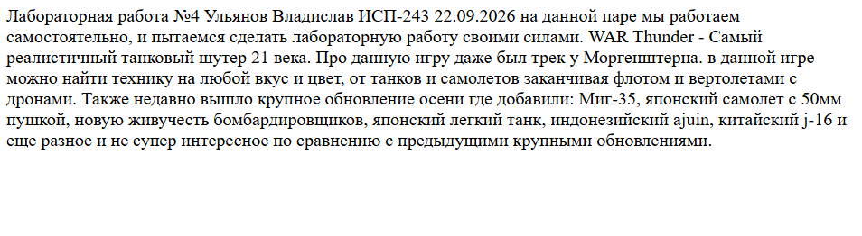

Ульянов Владислав
ИСП-243
22.09-26.09

# Практическая работа по markdown
Содержание:
1) Структура проекта
2) Примеры markdown
3) Пример latex
4) заключение

# Описание проекта
Данный проект посвящен markdown, который в свою очередь вполне может быть часто применен, за счет работы на github

# Примеры markdown

к примерам можно отнести:
- Заголовки:
    1) ###### 6 уровня
    2) ##### 5 уровня
    и т.д до 1 уровня

- Списки: 
    - не нумерованные 
    1) нумерованные

- Картинка


- Код
```csharp
Console.Writeline("поставьте максимальный балл пожалуйста")
```

- Примеры latex
$a^2$
$$
A = B + C
$$

Ссылка репозиторий:
https://github.com/ifgamek/Lab04_DotNet.git


